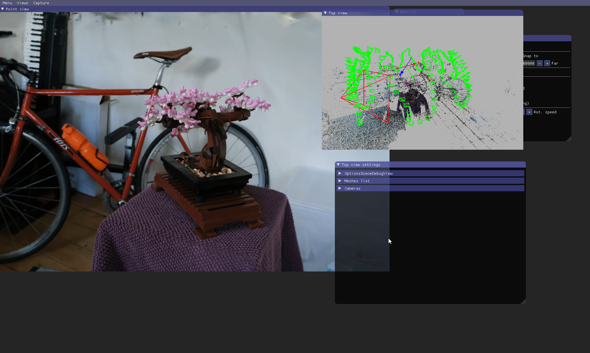

# 3D Gaussian Splatting for Real-Time Radiance Field Rendering
Bernhard Kerbl*, Georgios Kopanas*, Thomas Leimkühler, George Drettakis (* indicates equal contribution)<br>
| [Webpage](https://repo-sam.inria.fr/fungraph/3d-gaussian-splatting/) | [Full Paper](https://repo-sam.inria.fr/fungraph/3d-gaussian-splatting/3d_gaussian_splatting_high.pdf) | [Video](https://youtu.be/T_kXY43VZnk) | [Other GRAPHDECO Publications](http://www-sop.inria.fr/reves/publis/gdindex.php) | [FUNGRAPH project page](https://fungraph.inria.fr) |<br>
| [T&T+DB COLMAP (650MB)](https://repo-sam.inria.fr/fungraph/3d-gaussian-splatting/datasets/input/tandt_db.zip) | [Pre-trained Models (14 GB)](https://repo-sam.inria.fr/fungraph/3d-gaussian-splatting/datasets/pretrained/models.zip) | [Viewers for Windows (60MB)](https://repo-sam.inria.fr/fungraph/3d-gaussian-splatting/binaries/viewers.zip) | [Evaluation Images (7 GB)](https://repo-sam.inria.fr/fungraph/3d-gaussian-splatting/evaluation/images.zip) |<br>


This repository contains the official authors implementation associated with the paper "3D Gaussian Splatting for Real-Time Radiance Field Rendering", which can be found [here](https://repo-sam.inria.fr/fungraph/3d-gaussian-splatting/). We further provide the reference images used to create the error metrics reported in the paper, as well as recently created, pre-trained models. 

<a href="https://www.inria.fr/"> </a>
<a href="https://univ-cotedazur.eu/"> </a>
<a href="https://www.mpi-inf.mpg.de"> </a> 
<a href="https://team.inria.fr/graphdeco/"> </a>

Abstract: *Radiance Field methods have recently revolutionized novel-view synthesis of scenes captured with multiple photos or videos. However, achieving high visual quality still requires neural networks that are costly to train and render, while recent faster methods inevitably trade off speed for quality. For unbounded and complete scenes (rather than isolated objects) and 1080p resolution rendering, no current method can achieve real-time display rates. We introduce three key elements that allow us to achieve state-of-the-art visual quality while maintaining competitive training times and importantly allow high-quality real-time (≥ 30 fps) novel-view synthesis at 1080p resolution. First, starting from sparse points produced during camera calibration, we represent the scene with 3D Gaussians that preserve desirable properties of continuous volumetric radiance fields for scene optimization while avoiding unnecessary computation in empty space; Second, we perform interleaved optimization/density control of the 3D Gaussians, notably optimizing anisotropic covariance to achieve an accurate representation of the scene; Third, we develop a fast visibility-aware rendering algorithm that supports anisotropic splatting and both accelerates training and allows realtime rendering. We demonstrate state-of-the-art visual quality and real-time rendering on several established datasets.*

<section class="section" id="BibTeX">
  <div class="container is-max-desktop content">
    <h2 class="title">BibTeX</h2>
    <pre><code>@Article{kerbl3Dgaussians,
      author       = {Kerbl, Bernhard and Kopanas, Georgios and Leimk{\"u}hler, Thomas and Drettakis, George},
      title        = {3D Gaussian Splatting for Real-Time Radiance Field Rendering},
      journal      = {ACM Transactions on Graphics},
      number       = {4},
      volume       = {42},
      month        = {July},
      year         = {2023},
      url          = {https://repo-sam.inria.fr/fungraph/3d-gaussian-splatting/}
}</code></pre>
  </div>
</section>


## Funding and Acknowledgments

This research was funded by the ERC Advanced grant FUNGRAPH No 788065. The authors are grateful to Adobe for generous donations, the OPAL infrastructure from Université Côte d’Azur and for the HPC resources from GENCI–IDRIS (Grant 2022-AD011013409). The authors thank the anonymous reviewers for their valuable feedback, P. Hedman and A. Tewari for proofreading earlier drafts also T. Müller, A. Yu and S. Fridovich-Keil for helping with the comparisons.

## NEW FEATURES !

We have limited resources for maintaining and updating the code. However, we have added a few new features since the original release that are inspired by some of the excellent work many other researchers have been doing on 3DGS. We will be adding other features within the ability of our resources.

**Update of October 2024**: We integrated [training speed acceleration](#training-speed-acceleration) and made it compatible with [depth regularization](#depth-regularization), [anti-aliasing](#anti-aliasing) and [exposure compensation](#exposure-compensation). We have enhanced the SIBR real time viewer by correcting bugs and adding features in the [Top View](#sibr-top-view) that allows visualization of input and user cameras.

**Update of Spring 2024**:
Orange Labs has kindly added [OpenXR support](#openxr-support) for VR viewing. 

## Step-by-step Tutorial

Jonathan Stephens made a fantastic step-by-step tutorial for setting up Gaussian Splatting on your machine, along with instructions for creating usable datasets from videos. If the instructions below are too dry for you, go ahead and check it out [here](https://www.youtube.com/watch?v=UXtuigy_wYc).

## Colab

User [camenduru](https://github.com/camenduru) was kind enough to provide a Colab template that uses this repo's source (status: August 2023!) for quick and easy access to the method. Please check it out [here](https://github.com/camenduru/gaussian-splatting-colab).

## Cloning the Repository

The repository contains submodules, thus please check it out with 
```shell
# SSH
git clone git@github.com:graphdeco-inria/gaussian-splatting.git --recursive
```
or
```shell
# HTTPS
git clone https://github.com/graphdeco-inria/gaussian-splatting --recursive
```

## Overview

The codebase has 4 main components:
- A PyTorch-based optimizer to produce a 3D Gaussian model from SfM inputs
- A network viewer that allows to connect to and visualize the optimization process
- An OpenGL-based real-time viewer to render trained models in real-time.
- A script to help you turn your own images into optimization-ready SfM data sets

The components have different requirements w.r.t. both hardware and software. They have been tested on Windows 10 and Ubuntu Linux 22.04. Instructions for setting up and running each of them are found in the sections below.


## Optimizer

The optimizer uses PyTorch and CUDA extensions in a Python environment to produce trained models. 

### Hardware Requirements

- CUDA-ready GPU with Compute Capability 7.0+
- 24 GB VRAM (to train to paper evaluation quality)
- Please see FAQ for smaller VRAM configurations

### Software Requirements
- Conda (recommended for easy setup)
- C++ Compiler for PyTorch extensions (we used Visual Studio 2019 for Windows)
- CUDA SDK 11 for PyTorch extensions, install *after* Visual Studio (we used 11.8, **known issues with 11.6**)
- C++ Compiler and CUDA SDK must be compatible

### Setup

#### Local Setup

Our default, provided install method is based on Conda package and environment management:
```shell
SET DISTUTILS_USE_SDK=1 # Windows only
conda env create --file environment.yml
conda activate gaussian_splatting
```
Please note that this process assumes that you have CUDA SDK **11** installed, not **12**. For modifications, see below.

Tip: Downloading packages and creating a new environment with Conda can require a significant amount of disk space. By default, Conda will use the main system hard drive. You can avoid this by specifying a different package download location and an environment on a different drive:

```shell
conda config --add pkgs_dirs <Drive>/<pkg_path>
conda env create --file environment.yml --prefix <Drive>/<env_path>/gaussian_splatting
conda activate <Drive>/<env_path>/gaussian_splatting
```

#### Modifications

If you can afford the disk space, we recommend using our environment files for setting up a training environment identical to ours. If you want to make modifications, please note that major version changes might affect the results of our method. However, our (limited) experiments suggest that the codebase works just fine inside a more up-to-date environment (Python 3.8, PyTorch 2.0.0, CUDA 12). Make sure to create an environment where PyTorch and its CUDA runtime version match and the installed CUDA SDK has no major version difference with PyTorch's CUDA version.

#### Known Issues

Some users experience problems building the submodules on Windows (```cl.exe: File not found``` or similar). Please consider the workaround for this problem from the FAQ.

### Running

To run the optimizer, simply use

```shell
python train.py -s <path to COLMAP or NeRF Synthetic dataset>
```

<details>
<summary><span style="font-weight: bold;">Command Line Arguments for train.py</span></summary>

  #### --source_path / -s
  Path to the source directory containing a COLMAP or Synthetic NeRF data set.
  #### --model_path / -m 
  Path where the trained model should be stored (```output/<random>``` by default).
  #### --images / -i
  Alternative subdirectory for COLMAP images (```images``` by default).
  #### --eval
  Add this flag to use a MipNeRF360-style training/test split for evaluation.
  #### --resolution / -r
  Specifies resolution of the loaded images before training. If provided ```1, 2, 4``` or ```8```, uses original, 1/2, 1/4 or 1/8 resolution, respectively. For all other values, rescales the width to the given number while maintaining image aspect. **If not set and input image width exceeds 1.6K pixels, inputs are automatically rescaled to this target.**
  #### --data_device
  Specifies where to put the source image data, ```cuda``` by default, recommended to use ```cpu``` if training on large/high-resolution dataset, will reduce VRAM consumption, but slightly slow down training. Thanks to [HrsPythonix](https://github.com/HrsPythonix).
  #### --white_background / -w
  Add this flag to use white background instead of black (default), e.g., for evaluation of NeRF Synthetic dataset.
  #### --sh_degree
  Order of spherical harmonics to be used (no larger than 3). ```3``` by default.
  #### --convert_SHs_python
  Flag to make pipeline compute forward and backward of SHs with PyTorch instead of ours.
  #### --convert_cov3D_python
  Flag to make pipeline compute forward and backward of the 3D covariance with PyTorch instead of ours.
  #### --debug
  Enables debug mode if you experience erros. If the rasterizer fails, a ```dump``` file is created that you may forward to us in an issue so we can take a look.
  #### --debug_from
  Debugging is **slow**. You may specify an iteration (starting from 0) after which the above debugging becomes active.
  #### --iterations
  Number of total iterations to train for, ```30_000``` by default.
  #### --ip
  IP to start GUI server on, ```127.0.0.1``` by default.
  #### --port 
  Port to use for GUI server, ```6009``` by default.
  #### --test_iterations
  Space-separated iterations at which the training script computes L1 and PSNR over test set, ```7000 30000``` by default.
  #### --save_iterations
  Space-separated iterations at which the training script saves the Gaussian model, ```7000 30000 <iterations>``` by default.
  #### --checkpoint_iterations
  Space-separated iterations at which to store a checkpoint for continuing later, saved in the model directory.
  #### --start_checkpoint
  Path to a saved checkpoint to continue training from.
  #### --quiet 
  Flag to omit any text written to standard out pipe. 
  #### --feature_lr
  Spherical harmonics features learning rate, ```0.0025``` by default.
  #### --opacity_lr
  Opacity learning rate, ```0.05``` by default.
  #### --scaling_lr
  Scaling learning rate, ```0.005``` by default.
  #### --rotation_lr
  Rotation learning rate, ```0.001``` by default.
  #### --position_lr_max_steps
  Number of steps (from 0) where position learning rate goes from ```initial``` to ```final```. ```30_000``` by default.
  #### --position_lr_init
  Initial 3D position learning rate, ```0.00016``` by default.
  #### --position_lr_final
  Final 3D position learning rate, ```0.0000016``` by default.
  #### --position_lr_delay_mult
  Position learning rate multiplier (cf. Plenoxels), ```0.01``` by default. 
  #### --densify_from_iter
  Iteration where densification starts, ```500``` by default. 
  #### --densify_until_iter
  Iteration where densification stops, ```15_000``` by default.
  #### --densify_grad_threshold
  Limit that decides if points should be densified based on 2D position gradient, ```0.0002``` by default.
  #### --densification_interval
  How frequently to densify, ```100``` (every 100 iterations) by default.
  #### --opacity_reset_interval
  How frequently to reset opacity, ```3_000``` by default. 
  #### --lambda_dssim
  Influence of SSIM on total loss from 0 to 1, ```0.2``` by default. 
  #### --percent_dense
  Percentage of scene extent (0--1) a point must exceed to be forcibly densified, ```0.01``` by default.

</details>
<br>

Note that similar to MipNeRF360, we target images at resolutions in the 1-1.6K pixel range. For convenience, arbitrary-size inputs can be passed and will be automatically resized if their width exceeds 1600 pixels. We recommend to keep this behavior, but you may force training to use your higher-resolution images by setting ```-r 1```.

The MipNeRF360 scenes are hosted by the paper authors [here](https://jonbarron.info/mipnerf360/). You can find our SfM data sets for Tanks&Temples and Deep Blending [here](https://repo-sam.inria.fr/fungraph/3d-gaussian-splatting/datasets/input/tandt_db.zip). If you do not provide an output model directory (```-m```), trained models are written to folders with randomized unique names inside the ```output``` directory. At this point, the trained models may be viewed with the real-time viewer (see further below).

### Evaluation
By default, the trained models use all available images in the dataset. To train them while withholding a test set for evaluation, use the ```--eval``` flag. This way, you can render training/test sets and produce error metrics as follows:
```shell
python train.py -s <path to COLMAP or NeRF Synthetic dataset> --eval # Train with train/test split
python render.py -m <path to trained model> # Generate renderings
python metrics.py -m <path to trained model> # Compute error metrics on renderings
```

If you want to evaluate our [pre-trained models](https://repo-sam.inria.fr/fungraph/3d-gaussian-splatting/datasets/pretrained/models.zip), you will have to download the corresponding source data sets and indicate their location to ```render.py``` with an additional ```--source_path/-s``` flag. Note: The pre-trained models were created with the release codebase. This code base has been cleaned up and includes bugfixes, hence the metrics you get from evaluating them will differ from those in the paper.
```shell
python render.py -m <path to pre-trained model> -s <path to COLMAP dataset>
python metrics.py -m <path to pre-trained model>
```

<details>
<summary><span style="font-weight: bold;">Command Line Arguments for render.py</span></summary>

  #### --model_path / -m 
  Path to the trained model directory you want to create renderings for.
  #### --skip_train
  Flag to skip rendering the training set.
  #### --skip_test
  Flag to skip rendering the test set.
  #### --quiet 
  Flag to omit any text written to standard out pipe. 

  **The below parameters will be read automatically from the model path, based on what was used for training. However, you may override them by providing them explicitly on the command line.** 

  #### --source_path / -s
  Path to the source directory containing a COLMAP or Synthetic NeRF data set.
  #### --images / -i
  Alternative subdirectory for COLMAP images (```images``` by default).
  #### --eval
  Add this flag to use a MipNeRF360-style training/test split for evaluation.
  #### --resolution / -r
  Changes the resolution of the loaded images before training. If provided ```1, 2, 4``` or ```8```, uses original, 1/2, 1/4 or 1/8 resolution, respectively. For all other values, rescales the width to the given number while maintaining image aspect. ```1``` by default.
  #### --white_background / -w
  Add this flag to use white background instead of black (default), e.g., for evaluation of NeRF Synthetic dataset.
  #### --convert_SHs_python
  Flag to make pipeline render with computed SHs from PyTorch instead of ours.
  #### --convert_cov3D_python
  Flag to make pipeline render with computed 3D covariance from PyTorch instead of ours.

</details>

<details>
<summary><span style="font-weight: bold;">Command Line Arguments for metrics.py</span></summary>

  #### --model_paths / -m 
  Space-separated list of model paths for which metrics should be computed.
</details>
<br>

We further provide the ```full_eval.py``` script. This script specifies the routine used in our evaluation and demonstrates the use of some additional parameters, e.g., ```--images (-i)``` to define alternative image directories within COLMAP data sets. If you have downloaded and extracted all the training data, you can run it like this:
```shell
python full_eval.py -m360 <mipnerf360 folder> -tat <tanks and temples folder> -db <deep blending folder>
```
In the current version, this process takes about 7h on our reference machine containing an A6000. If you want to do the full evaluation on our pre-trained models, you can specify their download location and skip training. 
```shell
python full_eval.py -o <directory with pretrained models> --skip_training -m360 <mipnerf360 folder> -tat <tanks and temples folder> -db <deep blending folder>
```

If you want to compute the metrics on our paper's [evaluation images](https://repo-sam.inria.fr/fungraph/3d-gaussian-splatting/evaluation/images.zip), you can also skip rendering. In this case it is not necessary to provide the source datasets. You can compute metrics for multiple image sets at a time. 
```shell
python full_eval.py -m <directory with evaluation images>/garden ... --skip_training --skip_rendering
```

<details>
<summary><span style="font-weight: bold;">Command Line Arguments for full_eval.py</span></summary>
  
  #### --skip_training
  Flag to skip training stage.
  #### --skip_rendering
  Flag to skip rendering stage.
  #### --skip_metrics
  Flag to skip metrics calculation stage.
  #### --output_path
  Directory to put renderings and results in, ```./eval``` by default, set to pre-trained model location if evaluating them.
  #### --mipnerf360 / -m360
  Path to MipNeRF360 source datasets, required if training or rendering.
  #### --tanksandtemples / -tat
  Path to Tanks&Temples source datasets, required if training or rendering.
  #### --deepblending / -db
  Path to Deep Blending source datasets, required if training or rendering.
</details>
<br>

## Interactive Viewers
We provide two interactive viewers for our method: remote and real-time. Our viewing solutions are based on the [SIBR](https://sibr.gitlabpages.inria.fr/) framework, developed by the GRAPHDECO group for several novel-view synthesis projects.

### Hardware Requirements
- OpenGL 4.5-ready GPU and drivers (or latest MESA software)
- 4 GB VRAM recommended
- CUDA-ready GPU with Compute Capability 7.0+ (only for Real-Time Viewer)

### Software Requirements
- Visual Studio or g++, **not Clang** (we used Visual Studio 2019 for Windows)
- CUDA SDK 11, install *after* Visual Studio (we used 11.8)
- CMake (recent version, we used 3.24)
- 7zip (only on Windows)

### Pre-built Windows Binaries
We provide pre-built binaries for Windows [here](https://repo-sam.inria.fr/fungraph/3d-gaussian-splatting/binaries/viewers.zip). We recommend using them on Windows for an efficient setup, since the building of SIBR involves several external dependencies that must be downloaded and compiled on-the-fly.

### Installation from Source
If you cloned with submodules (e.g., using ```--recursive```), the source code for the viewers is found in ```SIBR_viewers```. The network viewer runs within the SIBR framework for Image-based Rendering applications.

#### Windows
CMake should take care of your dependencies.
```shell
cd SIBR_viewers
cmake -Bbuild .
cmake --build build --target install --config RelWithDebInfo
```
You may specify a different configuration, e.g. ```Debug``` if you need more control during development.

#### Ubuntu 22.04
You will need to install a few dependencies before running the project setup.
```shell
# Dependencies
sudo apt install -y libglew-dev libassimp-dev libboost-all-dev libgtk-3-dev libopencv-dev libglfw3-dev libavdevice-dev libavcodec-dev libeigen3-dev libxxf86vm-dev libembree-dev
# Project setup
cd SIBR_viewers
cmake -Bbuild . -DCMAKE_BUILD_TYPE=Release # add -G Ninja to build faster
cmake --build build -j24 --target install
``` 

#### Ubuntu 20.04
Backwards compatibility with Focal Fossa is not fully tested, but building SIBR with CMake should still work after invoking
```shell
git checkout fossa_compatibility
```

### Navigation in SIBR Viewers
The SIBR interface provides several methods of navigating the scene. By default, you will be started with an FPS navigator, which you can control with ```W, A, S, D, Q, E``` for camera translation and ```I, K, J, L, U, O``` for rotation. Alternatively, you may want to use a Trackball-style navigator (select from the floating menu). You can also snap to a camera from the data set with the ```Snap to``` button or find the closest camera with ```Snap to closest```. The floating menues also allow you to change the navigation speed. You can use the ```Scaling Modifier``` to control the size of the displayed Gaussians, or show the initial point cloud.

### Running the Network Viewer


https://github.com/graphdeco-inria/gaussian-splatting/assets/40643808/90a2e4d3-cf2e-4633-b35f-bfe284e28ff7


After extracting or installing the viewers, you may run the compiled ```SIBR_remoteGaussian_app[_config]``` app in ```<SIBR install dir>/bin```, e.g.: 
```shell
./<SIBR install dir>/bin/SIBR_remoteGaussian_app
```
The network viewer allows you to connect to a running training process on the same or a different machine. If you are training on the same machine and OS, no command line parameters should be required: the optimizer communicates the location of the training data to the network viewer. By default, optimizer and network viewer will try to establish a connection on **localhost** on port **6009**. You can change this behavior by providing matching ```--ip``` and ```--port``` parameters to both the optimizer and the network viewer. If for some reason the path used by the optimizer to find the training data is not reachable by the network viewer (e.g., due to them running on different (virtual) machines), you may specify an override location to the viewer by using ```-s <source path>```. 

<details>
<summary><span style="font-weight: bold;">Primary Command Line Arguments for Network Viewer</span></summary>

  #### --path / -s
  Argument to override model's path to source dataset.
  #### --ip
  IP to use for connection to a running training script.
  #### --port
  Port to use for connection to a running training script. 
  #### --rendering-size 
  Takes two space separated numbers to define the resolution at which network rendering occurs, ```1200``` width by default.
  Note that to enforce an aspect that differs from the input images, you need ```--force-aspect-ratio``` too.
  #### --load_images
  Flag to load source dataset images to be displayed in the top view for each camera.
</details>
<br>

### Running the Real-Time Viewer


https://github.com/graphdeco-inria/gaussian-splatting/assets/40643808/0940547f-1d82-4c2f-a616-44eabbf0f816


After extracting or installing the viewers, you may run the compiled ```SIBR_gaussianViewer_app[_config]``` app in ```<SIBR install dir>/bin```, e.g.: 
```shell
./<SIBR install dir>/bin/SIBR_gaussianViewer_app -m <path to trained model>
```

It should suffice to provide the ```-m``` parameter pointing to a trained model directory. Alternatively, you can specify an override location for training input data using ```-s```. To use a specific resolution other than the auto-chosen one, specify ```--rendering-size <width> <height>```. Combine it with ```--force-aspect-ratio``` if you want the exact resolution and don't mind image distortion. 

**To unlock the full frame rate, please disable V-Sync on your machine and also in the application (Menu &rarr; Display). In a multi-GPU system (e.g., laptop) your OpenGL/Display GPU should be the same as your CUDA GPU (e.g., by setting the application's GPU preference on Windows, see below) for maximum performance.**


In addition to the initial point cloud and the splats, you also have the option to visualize the Gaussians by rendering them as ellipsoids from the floating menu.
SIBR has many other functionalities, please see the [documentation](https://sibr.gitlabpages.inria.fr/) for more details on the viewer, navigation options etc. There is also a Top View (available from the menu) that shows the placement of the input cameras and the original SfM point cloud; please note that Top View slows rendering when enabled. The real-time viewer also uses slightly more aggressive, fast culling, which can be toggled in the floating menu. If you ever encounter an issue that can be solved by turning fast culling off, please let us know.

<details>
<summary><span style="font-weight: bold;">Primary Command Line Arguments for Real-Time Viewer</span></summary>

  #### --model-path / -m
  Path to trained model.
  #### --iteration
  Specifies which of state to load if multiple are available. Defaults to latest available iteration.
  #### --path / -s
  Argument to override model's path to source dataset.
  #### --rendering-size 
  Takes two space separated numbers to define the resolution at which real-time rendering occurs, ```1200``` width by default. Note that to enforce an aspect that differs from the input images, you need ```--force-aspect-ratio``` too.
  #### --load_images
  Flag to load source dataset images to be displayed in the top view for each camera.
  #### --device
  Index of CUDA device to use for rasterization if multiple are available, ```0``` by default.
  #### --no_interop
  Disables CUDA/GL interop forcibly. Use on systems that may not behave according to spec (e.g., WSL2 with MESA GL 4.5 software rendering).
</details>
<br>

## Processing your own Scenes

Our COLMAP loaders expect the following dataset structure in the source path location:

```
<location>
|---images
|   |---<image 0>
|   |---<image 1>
|   |---...
|---sparse
    |---0
        |---cameras.bin
        |---images.bin
        |---points3D.bin
```

For rasterization, the camera models must be either a SIMPLE_PINHOLE or PINHOLE camera. We provide a converter script ```convert.py```, to extract undistorted images and SfM information from input images. Optionally, you can use ImageMagick to resize the undistorted images. This rescaling is similar to MipNeRF360, i.e., it creates images with 1/2, 1/4 and 1/8 the original resolution in corresponding folders. To use them, please first install a recent version of COLMAP (ideally CUDA-powered) and ImageMagick. Put the images you want to use in a directory ```<location>/input```.
```
<location>
|---input
    |---<image 0>
    |---<image 1>
    |---...
```
 If you have COLMAP and ImageMagick on your system path, you can simply run 
```shell
python convert.py -s <location> [--resize] #If not resizing, ImageMagick is not needed
```
Alternatively, you can use the optional parameters ```--colmap_executable``` and ```--magick_executable``` to point to the respective paths. Please note that on Windows, the executable should point to the COLMAP ```.bat``` file that takes care of setting the execution environment. Once done, ```<location>``` will contain the expected COLMAP data set structure with undistorted, resized input images, in addition to your original images and some temporary (distorted) data in the directory ```distorted```.

If you have your own COLMAP dataset without undistortion (e.g., using ```OPENCV``` camera), you can try to just run the last part of the script: Put the images in ```input``` and the COLMAP info in a subdirectory ```distorted```:
```
<location>
|---input
|   |---<image 0>
|   |---<image 1>
|   |---...
|---distorted
    |---database.db
    |---sparse
        |---0
            |---...
```
Then run 
```shell
python convert.py -s <location> --skip_matching [--resize] #If not resizing, ImageMagick is not needed
```

<details>
<summary><span style="font-weight: bold;">Command Line Arguments for convert.py</span></summary>

  #### --no_gpu
  Flag to avoid using GPU in COLMAP.
  #### --skip_matching
  Flag to indicate that COLMAP info is available for images.
  #### --source_path / -s
  Location of the inputs.
  #### --camera 
  Which camera model to use for the early matching steps, ```OPENCV``` by default.
  #### --resize
  Flag for creating resized versions of input images.
  #### --colmap_executable
  Path to the COLMAP executable (```.bat``` on Windows).
  #### --magick_executable
  Path to the ImageMagick executable.
</details>
<br>

### Training speed acceleration

We integrated the drop-in replacements from [Taming-3dgs](https://humansensinglab.github.io/taming-3dgs/)<sup>1</sup> with [fused ssim](https://github.com/rahul-goel/fused-ssim/tree/main) into the original codebase to speed up training times. Once installed, the accelerated rasterizer delivers a **$\times$ 1.6 training time speedup** using `--optimizer_type default` and a **$\times$ 2.7 training time speedup** using `--optimizer_type sparse_adam`.

To get faster training times you must first install the accelerated rasterizer to your environment:

```bash
pip uninstall diff-gaussian-rasterization -y
cd submodules/diff-gaussian-rasterization
rm -r build
git checkout 3dgs_accel
pip install .
```

Then you can add the following parameter to use the sparse adam optimizer when running `train.py`:

```bash
--optimizer_type sparse_adam
```

*Note that this custom rasterizer has a different behaviour than the original version, for more details on training times please see [stats for training times](results.md/#training-times-comparisons)*.

*1. Mallick and Goel, et al. ‘Taming 3DGS: High-Quality Radiance Fields with Limited Resources’. SIGGRAPH Asia 2024 Conference Papers, 2024, https://doi.org/10.1145/3680528.3687694, [github](https://github.com/humansensinglab/taming-3dgs)*


### Depth regularization

To have better reconstructed scenes we use depth maps as priors during optimization with each input images. It works best on untextured parts ex: roads and can remove floaters. Several papers have used similar ideas to improve various aspects of 3DGS; (e.g. [DepthRegularizedGS](https://robot0321.github.io/DepthRegGS/index.html), [SparseGS](https://formycat.github.io/SparseGS-Real-Time-360-Sparse-View-Synthesis-using-Gaussian-Splatting/), [DNGaussian](https://fictionarry.github.io/DNGaussian/)). The depth regularization we integrated is that used in our [Hierarchical 3DGS](https://repo-sam.inria.fr/fungraph/hierarchical-3d-gaussians/) paper, but applied to the original 3DGS; for some scenes (e.g., the DeepBlending scenes) it improves quality significantly; for others it either makes a small difference or can even be worse. For example results showing the potential benefit and statistics on quality please see here: [Stats for depth regularization](results.md).

When training on a synthetic dataset, depth maps can be produced and they do not require further processing to be used in our method.

For real world datasets depth maps should be generated for each input images, to generate them please do the following:
1. Clone [Depth Anything v2](https://github.com/DepthAnything/Depth-Anything-V2?tab=readme-ov-file#usage):
    ```
    git clone https://github.com/DepthAnything/Depth-Anything-V2.git
    ```
2. Download weights from [Depth-Anything-V2-Large](https://huggingface.co/depth-anything/Depth-Anything-V2-Large/resolve/main/depth_anything_v2_vitl.pth?download=true) and place it under `Depth-Anything-V2/checkpoints/`
3. Generate depth maps:
   ```
   python Depth-Anything-V2/run.py --encoder vitl --pred-only --grayscale --img-path <path to input images> --outdir <output path>
   ```
5. Generate a `depth_params.json` file using:
    ```
    python utils/make_depth_scale.py --base_dir <path to colmap> --depths_dir <path to generated depths>
    ```

A new parameter should be set when training if you want to use depth regularization `-d <path to depth maps>`.

### Exposure compensation
To compensate for exposure changes in the different input images we optimize an affine transformation for each image just as in [Hierarchical 3dgs](https://repo-sam.inria.fr/fungraph/hierarchical-3d-gaussians/).  

This can greatly improve reconstruction results for "in the wild" captures, e.g., with a smartphone when the exposure setting of the camera is not fixed. For example results showing the potential benefit and statistics on quality please see here: [Stats for exposure compensation](results.md).

Add the following parameters to enable it:
```
--exposure_lr_init 0.001 --exposure_lr_final 0.0001 --exposure_lr_delay_steps 5000 --exposure_lr_delay_mult 0.001 --train_test_exp
```
Again, other excellent papers have used similar ideas e.g. [NeRF-W](https://nerf-w.github.io/), [URF](https://urban-radiance-fields.github.io/).

### Anti-aliasing
We added the EWA Filter from [Mip Splatting](https://niujinshuchong.github.io/mip-splatting/) in our codebase to remove aliasing. It is disabled by default but you can enable it by adding `--antialiasing` when training on a scene using `train.py` or rendering using `render.py`. Antialiasing can be toggled in the SIBR viewer, it is disabled by default but you should enable it when viewing a scene trained using `--antialiasing`.

*this scene was trained using `--antialiasing`*.

### SIBR: Top view
> `Views > Top view`

The `Top view` renders the SfM point cloud in another view with the corresponding input cameras and the `Point view` user camera. This allows visualization of how far the viewer is from the input cameras for example.

It is a 3D view so the user can navigate through it just as in the `Point view` (modes available: FPS, trackball, orbit).
<!-- _gif showing the top view, showing it is realtime_ -->
<!--  -->


Options are available to customize this view, meshes can be disabled/enabled and their scales can be modified. 
<!-- _gif showing different options_ -->
<!--  -->

A useful additional functionality is to move to the position of an input image, and progressively fade out to the SfM point view in that position (e.g., to verify camera alignment). Views from input cameras can be displayed in the `Top view` (*note that `--images-path` must be set in the command line*). One can snap the `Top view` camera to the closest input camera from the user camera in the `Point view` by clicking `Top view settings > Cameras > Snap to closest`. 
<!-- _gif showing for a snapped camera the ground truth image with alpha_ -->
<!--  -->


### OpenXR support

OpenXR is supported in the branch `gaussian_code_release_openxr` 
Within that branch, you can find documentation for VR support [here](https://gitlab.inria.fr/sibr/sibr_core/-/tree/gaussian_code_release_openxr?ref_type=heads).


## FAQ
- *Where do I get data sets, e.g., those referenced in ```full_eval.py```?* The MipNeRF360 data set is provided by the authors of the original paper on the project site. Note that two of the data sets cannot be openly shared and require you to consult the authors directly. For Tanks&Temples and Deep Blending, please use the download links provided at the top of the page. Alternatively, you may access the cloned data (status: August 2023!) from [HuggingFace](https://huggingface.co/camenduru/gaussian-splatting)


- *How can I use this for a much larger dataset, like a city district?* The current method was not designed for these, but given enough memory, it should work out. However, the approach can struggle in multi-scale detail scenes (extreme close-ups, mixed with far-away shots). This is usually the case in, e.g., driving data sets (cars close up, buildings far away). For such scenes, you can lower the ```--position_lr_init```, ```--position_lr_final``` and ```--scaling_lr``` (x0.3, x0.1, ...). The more extensive the scene, the lower these values should be. Below, we use default learning rates (left) and ```--position_lr_init 0.000016 --scaling_lr 0.001"``` (right).

|  <!-- --> | <!-- -->  |
| --- | --- |

- *I'm on Windows and I can't manage to build the submodules, what do I do?* Consider following the steps in the excellent video tutorial [here](https://www.youtube.com/watch?v=UXtuigy_wYc), hopefully they should help. The order in which the steps are done is important! Alternatively, consider using the linked Colab template.

- *It still doesn't work. It says something about ```cl.exe```. What do I do?* User Henry Pearce found a workaround. You can you try adding the visual studio path to your environment variables (your version number might differ);
```C:\Program Files (x86)\Microsoft Visual Studio\2019\Community\VC\Tools\MSVC\14.29.30133\bin\Hostx64\x64```
Then make sure you start a new conda prompt and cd to your repo location and try this;
```
conda activate gaussian_splatting
cd <dir_to_repo>/gaussian-splatting
pip install submodules\diff-gaussian-rasterization
pip install submodules\simple-knn
```

- *I'm on macOS/Puppy Linux/Greenhat and I can't manage to build, what do I do?* Sorry, we can't provide support for platforms outside of the ones we list in this README. Consider using the linked Colab template.

- *I don't have 24 GB of VRAM for training, what do I do?* The VRAM consumption is determined by the number of points that are being optimized, which increases over time. If you only want to train to 7k iterations, you will need significantly less. To do the full training routine and avoid running out of memory, you can increase the ```--densify_grad_threshold```, ```--densification_interval``` or reduce the value of ```--densify_until_iter```. Note however that this will affect the quality of the result. Also try setting ```--test_iterations``` to ```-1``` to avoid memory spikes during testing. If ```--densify_grad_threshold``` is very high, no densification should occur and training should complete if the scene itself loads successfully.

- *24 GB of VRAM for reference quality training is still a lot! Can't we do it with less?* Yes, most likely. By our calculations it should be possible with **way** less memory (~8GB). If we can find the time we will try to achieve this. If some PyTorch veteran out there wants to tackle this, we look forward to your pull request!


- *How can I use the differentiable Gaussian rasterizer for my own project?* Easy, it is included in this repo as a submodule ```diff-gaussian-rasterization```. Feel free to check out and install the package. It's not really documented, but using it from the Python side is very straightforward (cf. ```gaussian_renderer/__init__.py```).

- *Wait, but ```<insert feature>``` isn't optimized and could be much better?* There are several parts we didn't even have time to think about improving (yet). The performance you get with this prototype is probably a rather slow baseline for what is physically possible.

- *Something is broken, how did this happen?* We tried hard to provide a solid and comprehensible basis to make use of the paper's method. We have refactored the code quite a bit, but we have limited capacity to test all possible usage scenarios. Thus, if part of the website, the code or the performance is lacking, please create an issue. If we find the time, we will do our best to address it.
