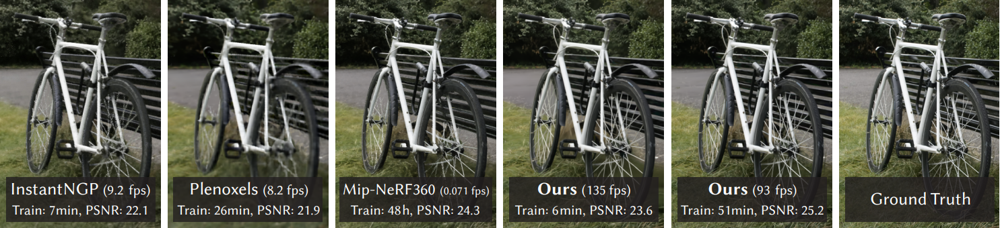
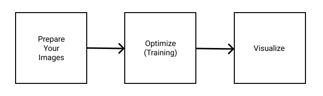
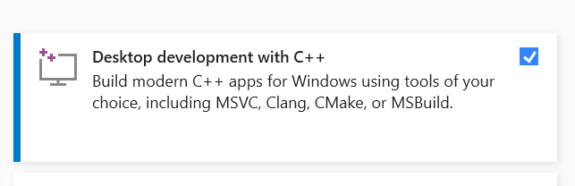
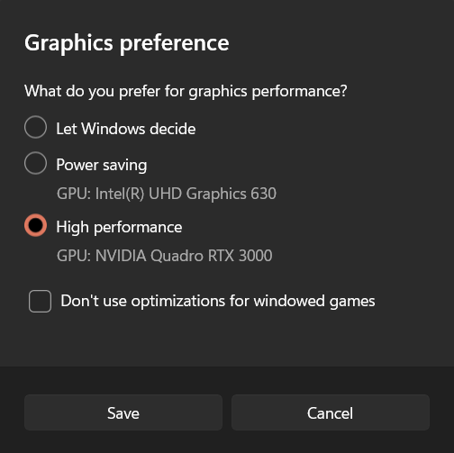
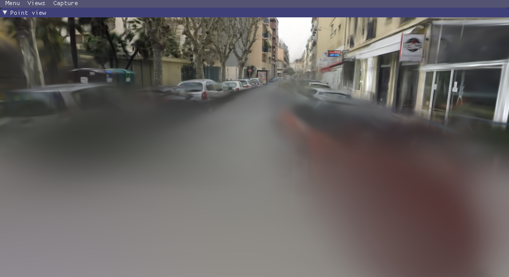
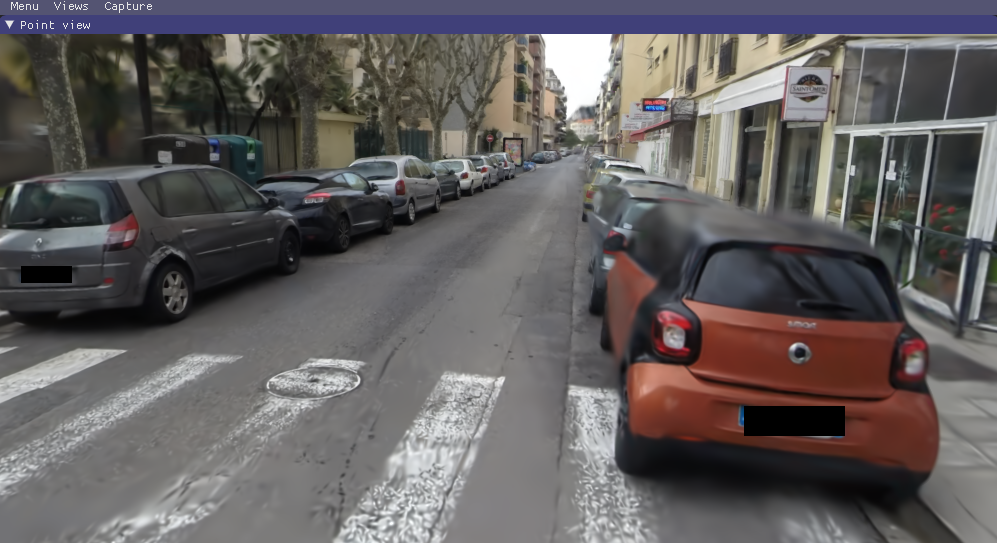

# 3D Gaussian Splatting for Real-Time Radiance Field Rendering

### Read first
__This is a forked Windows Installation Tutorial and the main codes will not be updated__
This forked GitHub project is intented for folks who have little to know command-line knowledge and want to install, train, and view 3D Gaussian Splatting. If you have used Instant NGP, Nerftudio, or other similar command-line based radiance field projects, most likely you have already installed some or all of the depedencies required for this project.

I created a <a href="https://youtu.be/UXtuigy_wYc?si=93d4d1iP30NMgfYm" target="_blank">walkthrough video</a>  to compliment the installation instructions. You can watch it independently or with this project page as reference. Please follow my YT channel for additional updates. Now let's get 3D Gaussian Splatting!

The section below is from the original GitHub page. Jump down to [Overview](#overview) to get started. <br>
<br>
<br>


# About 3D Gaussian Splatting for Real-Time Radiance Field Rendering
Bernhard Kerbl*, Georgios Kopanas*, Thomas Leimkühler, George Drettakis (* indicates equal contribution)<br>
| [Webpage](https://repo-sam.inria.fr/fungraph/3d-gaussian-splatting/) | [Full Paper](https://repo-sam.inria.fr/fungraph/3d-gaussian-splatting/3d_gaussian_splatting_high.pdf) |
[Video](https://youtu.be/T_kXY43VZnk) | [Other GRAPHDECO Publications](http://www-sop.inria.fr/reves/publis/gdindex.php) | [FUNGRAPH project page](https://fungraph.inria.fr) |

| [T&T+DB COLMAP (650MB)](https://repo-sam.inria.fr/fungraph/3d-gaussian-splatting/datasets/input/tandt_db.zip) | [Pre-trained Models (14 GB)](https://repo-sam.inria.fr/fungraph/3d-gaussian-splatting/datasets/pretrained/models.zip) | [Viewers for Windows (60MB)](https://repo-sam.inria.fr/fungraph/3d-gaussian-splatting/binaries/viewers.zip) | [Evaluation Images (7 GB)](https://repo-sam.inria.fr/fungraph/3d-gaussian-splatting/evaluation/images.zip) |  <br>


This repository contains the official authors implementation associated with the paper "3D Gaussian Splatting for Real-Time Radiance Field Rendering", which can be found [here](https://repo-sam.inria.fr/fungraph/3d-gaussian-splatting/). We further provide the reference images used to create the error metrics reported in the paper, as well as recently created, pre-trained models. 

<a href="https://www.inria.fr/"> </a>
<a href="https://univ-cotedazur.eu/"> </a>
<a href="https://www.mpi-inf.mpg.de"> </a> 
<a href="https://team.inria.fr/graphdeco/"> </a>

Abstract: *Radiance Field methods have recently revolutionized novel-view synthesis of scenes captured with multiple photos or videos. However, achieving high visual quality still requires neural networks that are costly to train and render, while recent faster methods inevitably trade off speed for quality. For unbounded and complete scenes (rather than isolated objects) and 1080p resolution rendering, no current method can achieve real-time display rates. We introduce three key elements that allow us to achieve state-of-the-art visual quality while maintaining competitive training times and importantly allow high-quality real-time (≥ 30 fps) novel-view synthesis at 1080p resolution. First, starting from sparse points produced during camera calibration, we represent the scene with 3D Gaussians that preserve desirable properties of continuous volumetric radiance fields for scene optimization while avoiding unnecessary computation in empty space; Second, we perform interleaved optimization/density control of the 3D Gaussians, notably optimizing anisotropic covariance to achieve an accurate representation of the scene; Third, we develop a fast visibility-aware rendering algorithm that supports anisotropic splatting and both accelerates training and allows realtime rendering. We demonstrate state-of-the-art visual quality and real-time rendering on several established datasets.*

<section class="section" id="BibTeX">
  <div class="container is-max-desktop content">
    <h2 class="title">BibTeX</h2>
    <pre><code>@Article{kerbl3Dgaussians,
      author       = {Kerbl, Bernhard and Kopanas, Georgios and Leimk{\"u}hler, Thomas and Drettakis, George},
      title        = {3D Gaussian Splatting for Real-Time Radiance Field Rendering},
      journal      = {ACM Transactions on Graphics},
      number       = {4},
      volume       = {42},
      month        = {July},
      year         = {2023},
      url          = {https://repo-sam.inria.fr/fungraph/3d-gaussian-splatting/}
}</code></pre>
  </div>
</section>


## Funding and Acknowledgments

This research was funded by the ERC Advanced grant FUNGRAPH No 788065. The authors are grateful to Adobe for generous donations, the OPAL infrastructure from Université Côte d’Azur and for the HPC resources from GENCI–IDRIS (Grant 2022-AD011013409). The authors thank the anonymous reviewers for their valuable feedback, P. Hedman and A. Tewari for proofreading earlier drafts also T. Müller, A. Yu and S. Fridovich-Keil for helping with the comparisons.

## Overview

The codebase has 4 main components:
- A script to help you turn your own images into optimization-ready SfM data sets
- A PyTorch-based optimizer to produce a 3D Gaussian model from SfM inputs
- A network viewer that allows to connect to and visualize the optimization process **(ommitted from this fork for simplicity, please see original repo)**
- An OpenGL-based real-time viewer to render trained models in real-time.


Here is what the workflow looks like: <br>



## Requirements
This is the hardware and software required to run 3D Gaussian Splatting for Real-Time Radiance Fields. Technically, the viewer has much smaller requirements compared to the the optimizer. I decided to list the 

### Hardware
- An NVIDIA GPU with 24GB VRAM* or more. Preferably an RTX 3090 or better. _*Future updates to these instructions will have options to modify training for GPUs with less VRAM such as a 3080._

### Software
This is the sofware dependencies you will need installed prior to installing the project. Many of these dependencies are shared with other NeRF projects.
- __Git__ - You will need this to pull the code from GitHub. You can download it [here ](https://git-scm.com/downloads). Follow default installation instructions. You can test to see if you have it already installed by typing ```git --version``` into command prompt
- __Conda__ - I recommend using [Anaconda](https://www.anaconda.com/download) because it's easy to install and manage environments in the future. [MiniConda](https://docs.conda.io/en/latest/miniconda.html) is a great lightweight alternative.
- __CUDA Toolkit__ - this was tested with 11.8. Ensure you are not running 11.6 or 12+. You can download CUDA Toolkit [here](https://developer.nvidia.com/cuda-toolkit-archive) You can check which version of CUDA Toolkit you have installed by typing ```nvcc --version``` into command prompt.
- __Visual Studio 2019 or newer__ - You can download and install it [here](https://visualstudio.microsoft.com/vs/older-downloads/). Make sure you add __Desktop Development with C++__ when installing <br>

- __COLMAP__ - Use the Windows binary, it's easy! You can download it [here](https://github.com/colmap/colmap/releases)
- __ImageMagik__ - This is for preparing your images. Download it [here](https://imagemagick.org/script/download.php)
- __FFMPEG__ - Use this to extract images from video. Download it [here](https://ffmpeg.org/download.html)


## Cloning the Repository
You will need to pull a copy of the code from GitHub. You will do this by using Git which was pre-installed during the dependencies section of this tutorial. You can also use GitHub desktop to clone the repository. Follow these steps to clone the repository: <br>

1. Open Windows Command Prompt by tying "cmd" into your search bar.
2. Copy the below code into command prompt and press enter

```git clone https://github.com/graphdeco-inria/gaussian-splatting --recursive```

The folder will download to the root of our command line prompt with the name "Gaussian-Splatting". Typically in your ```C:User/<username>``` folder. For example, on my PC the folder is now located at C:User/Jonat/Guassian-Splatting

## Installing the Optimizer

To install the code that you pulled from GitHub, you will need to create a Conda environment that includes all of the compailed code for running. Open command prompt and enter these lines below one at a time. The second line will compile the code which can take 10 minutes or longer. The last line will "activate" the conda environment. You will need to enter ```conda activate gaussian_splatting``` at the start of each session you plan to optimize 3D Gaussian Splatting.

```shell
SET DISTUTILS_USE_SDK=1
conda env create --file environment.yml
conda activate gaussian_splatting
```
Please note that this process assumes that you have CUDA SDK **11** installed, not **12**. For modifications, see below.

Tip: Downloading packages and creating a new environment with Conda can require a significant amount of disk space. By default, Conda will use the main system hard drive. You can avoid this by specifying a different package download location and an environment on a different drive:

```shell
conda config --add pkgs_dirs <Drive>/<pkg_path>
conda env create --file environment.yml --prefix <Drive>/<env_path>/gaussian_splatting
conda activate <Drive>/<env_path>/gaussian_splatting
```

## Preparing Images From Your Own Scenes

Our COLMAP loaders expect the following dataset structure in the source path location:

```
<location>
|---images
|   |---<image 0>
|   |---<image 1>
|   |---...
|---sparse
    |---0
        |---cameras.bin
        |---images.bin
        |---points3D.bin
```

For rasterization, the camera models must be either a SIMPLE_PINHOLE or PINHOLE camera. We provide a converter script ```convert.py```, to extract undistorted images and SfM information from input images. Optionally, you can use ImageMagick to resize the undistorted images. This rescaling is similar to MipNeRF360, i.e., it creates images with 1/2, 1/4 and 1/8 the original resolution in corresponding folders. To use them, please first install a recent version of COLMAP (ideally CUDA-powered) and ImageMagick. Put the images you want to use in a directory ```<location>/input```.
```
<location>
|---input
    |---<image 0>
    |---<image 1>
    |---...
```
 If you have COLMAP and ImageMagick on your system path, you can simply run 
```shell
python convert.py -s <location> [--resize] #If not resizing, ImageMagick is not needed
```
Alternatively, you can use the optional parameters ```--colmap_executable``` and ```--magick_executable``` to point to the respective paths. Please note that on Windows, the executable should point to the COLMAP ```.bat``` file that takes care of setting the execution environment. Once done, ```<location>``` will contain the expected COLMAP data set structure with undistorted, resized input images, in addition to your original images and some temporary (distorted) data in the directory ```distorted```.

If you have your own COLMAP dataset without undistortion (e.g., using ```OPENCV``` camera), you can try to just run the last part of the script: Put the images in ```input``` and the COLMAP info in a subdirectory ```distorted```:
```
<location>
|---input
|   |---<image 0>
|   |---<image 1>
|   |---...
|---distorted
    |---database.db
    |---sparse
        |---0
            |---...
```
Then run 
```shell
python convert.py -s <location> --skip_matching [--resize] #If not resizing, ImageMagick is not needed
```

<details>
<summary><span style="font-weight: bold;">Command Line Arguments for convert.py</span></summary>

  #### --no_gpu
  Flag to avoid using GPU in COLMAP.
  #### --skip_matching
  Flag to indicate that COLMAP info is available for images.
  #### --source_path / -s
  Location of the inputs.
  #### --camera 
  Which camera model to use for the early matching steps, ```OPENCV``` by default.
  #### --resize
  Flag for creating resized versions of input images.
  #### --colmap_executable
  Path to the COLMAP executable (```.bat``` on Windows).
  #### --magick_executable
  Path to the ImageMagick executable.
</details>
<br>


## Optimizer

The optimizer uses PyTorch and CUDA extensions in a Python environment to produce trained models. These trained models are what you view in the real-time viewer. This is where you "processes your dataset" into 3D Guassian Splats.


### Running

To run the optimizer, ensure you have the Conda environment active. You should see (gaussian_splatting) at the front of your command prompt string. If you do not see it, use this command to activate the Conda environement ```conda activate gaussian_splatting```

 have pathed to the Gaussian-splatting folder within command promps

, simply use

```shell
python train.py -s <path to COLMAP or NeRF Synthetic dataset>
```

<details>
<summary><span style="font-weight: bold;">Command Line Arguments for train.py</span></summary>

  #### --source_path / -s
  Path to the source directory containing a COLMAP or Synthetic NeRF data set.
  #### --model_path / -m 
  Path where the trained model should be stored (```output/<random>``` by default).
  #### --images / -i
  Alternative subdirectory for COLMAP images (```images``` by default).
  #### --eval
  Add this flag to use a MipNeRF360-style training/test split for evaluation.
  #### --resolution / -r
  Specifies resolution of the loaded images before training. If provided ```1, 2, 4``` or ```8```, uses original, 1/2, 1/4 or 1/8 resolution, respectively. For all other values, rescales the width to the given number while maintaining image aspect. **If not set and input image width exceeds 1.6K pixels, inputs are automatically rescaled to this target.**
  #### --data_device
  Specifies where to put the source image data, ```cuda``` by default, recommended to use ```cpu``` if training on large/high-resolution dataset, will reduce VRAM consumption, but slightly slow down training.
  #### --white_background / -w
  Add this flag to use white background instead of black (default), e.g., for evaluation of NeRF Synthetic dataset.
  #### --sh_degree
  Order of spherical harmonics to be used (no larger than 3). ```3``` by default.
  #### --convert_SHs_python
  Flag to make pipeline compute forward and backward of SHs with PyTorch instead of ours.
  #### --convert_cov3D_python
  Flag to make pipeline compute forward and backward of the 3D covariance with PyTorch instead of ours.
  #### --debug
  Enables debug mode if you experience erros. If the rasterizer fails, a ```dump``` file is created that you may forward to us in an issue so we can take a look.
  #### --debug_from
  Debugging is **slow**. You may specify an iteration (starting from 0) after which the above debugging becomes active.
  #### --iterations
  Number of total iterations to train for, ```30_000``` by default.
  #### --ip
  IP to start GUI server on, ```127.0.0.1``` by default.
  #### --port 
  Port to use for GUI server, ```6009``` by default.
  #### --test_iterations
  Space-separated iterations at which the training script computes L1 and PSNR over test set, ```7000 30000``` by default.
  #### --save_iterations
  Space-separated iterations at which the training script saves the Gaussian model, ```7000 30000 <iterations>``` by default.
  #### --checkpoint_iterations
  Space-separated iterations at which to store a checkpoint for continuing later, saved in the model directory.
  #### --start_checkpoint
  Path to a saved checkpoint to continue training from.
  #### --quiet 
  Flag to omit any text written to standard out pipe. 
  #### --feature_lr
  Spherical harmonics features learning rate, ```0.0025``` by default.
  #### --opacity_lr
  Opacity learning rate, ```0.05``` by default.
  #### --scaling_lr
  Scaling learning rate, ```0.005``` by default.
  #### --rotation_lr
  Rotation learning rate, ```0.001``` by default.
  #### --position_lr_max_steps
  Number of steps (from 0) where position learning rate goes from ```initial``` to ```final```. ```30_000``` by default.
  #### --position_lr_init
  Initial 3D position learning rate, ```0.00016``` by default.
  #### --position_lr_final
  Final 3D position learning rate, ```0.0000016``` by default.
  #### --position_lr_delay_mult
  Position learning rate multiplier (cf. Plenoxels), ```0.01``` by default. 
  #### --densify_from_iter
  Iteration where densification starts, ```500``` by default. 
  #### --densify_until_iter
  Iteration where densification stops, ```15_000``` by default.
  #### --densify_grad_threshold
  Limit that decides if points should be densified based on 2D position gradient, ```0.0002``` by default.
  #### --densification_interal
  How frequently to densify, ```100``` (every 100 iterations) by default.
  #### --opacity_reset_interval
  How frequently to reset opacity, ```3_000``` by default. 
  #### --lambda_dssim
  Influence of SSIM on total loss from 0 to 1, ```0.2``` by default. 
  #### --percent_dense
  Percentage of scene extent (0--1) a point must exceed to be forcibly densified, ```0.01``` by default.

</details>
<br>

Note that similar to MipNeRF360, we target images at resolutions in the 1-1.6K pixel range. For convenience, arbitrary-size inputs can be passed and will be automatically resized if their width exceeds 1600 pixels. We recommend to keep this behavior, but you may force training to use your higher-resolution images by setting ```-r 1```.

The MipNeRF360 scenes are hosted by the paper authors [here](https://jonbarron.info/mipnerf360/). You can find our SfM data sets for Tanks&Temples and Deep Blending [here](https://repo-sam.inria.fr/fungraph/3d-gaussian-splatting/datasets/input/tandt_db.zip). If you do not provide an output model directory (```-m```), trained models are written to folders with randomized unique names inside the ```output``` directory. At this point, the trained models may be viewed with the real-time viewer (see further below).


## Interactive Viewers
We provide two interactive viewers for our method: remote and real-time. Our viewing solutions are based on the [SIBR](https://sibr.gitlabpages.inria.fr/) framework, developed by the GRAPHDECO group for several novel-view synthesis projects.


### Pre-built Windows Binaries
We provide pre-built binaries for Windows [here](https://repo-sam.inria.fr/fungraph/3d-gaussian-splatting/binaries/viewers.zip). We recommend using them on Windows for an efficient setup, since the building of SIBR involves several external dependencies that must be downloaded and compiled on-the-fly.

Simply download the viewer.zip file from the links above and extact the 


### Navigation in SIBR Viewers
The SIBR interface provides several methods of navigating the scene. By default, you will be started with an FPS navigator, which you can control with ```W, A, S, D, Q, E``` for camera translation and ```I, K, J, L, U, O``` for rotation. Alternatively, you may want to use a Trackball-style navigator (select from the floating menu). You can also snap to a camera from the data set with the ```Snap to``` button or find the closest camera with ```Snap to closest```. The floating menues also allow you to change the navigation speed. You can use the ```Scaling Modifier``` to control the size of the displayed Gaussians, or show the initial point cloud.


### Running the Real-Time Viewer


https://github.com/graphdeco-inria/gaussian-splatting/assets/40643808/0940547f-1d82-4c2f-a616-44eabbf0f816


After extracting or installing the viewers, you may run the compiled ```SIBR_gaussianViewer_app[_config]``` app in ```<SIBR install dir>/bin```, e.g.: 
```shell
./<SIBR install dir>/bin/SIBR_gaussianViewer_app -m <path to trained model>
```

It should suffice to provide the ```-m``` parameter pointing to a trained model directory. Alternatively, you can specify an override location for training input data using ```-s```. To use a specific resolution other than the auto-chosen one, specify ```--rendering-size <width> <height>```. Combine it with ```--force-aspect-ratio``` if you want the exact resolution and don't mind image distortion. 

**To unlock the full frame rate, please disable V-Sync on your machine and also in the application (Menu &rarr; Display). In a multi-GPU system (e.g., laptop) your OpenGL/Display GPU should be the same as your CUDA GPU (e.g., by setting the application's GPU preference on Windows, see below) for maximum performance.**



In addition to the intial point cloud and the splats, you also have the option to visualize the Gaussians by rendering them as ellipsoids from the floating menu.
SIBR has many other functionalities, please see the [documentation](https://sibr.gitlabpages.inria.fr/) for more details on the viewer, navigation options etc. There is also a Top View (available from the menu) that shows the placement of the input cameras and the original SfM point cloud; please note that Top View slows rendering when enabled. The real-time viewer also uses slightly more aggressive, fast culling, which can be toggled in the floating menu. If you ever encounter an issue that can be solved by turning fast culling off, please let us know.

<details>
<summary><span style="font-weight: bold;">Primary Command Line Arguments for Real-Time Viewer</span></summary>

  #### --model-path / -m
  Path to trained model.
  #### --iteration
  Specifies which of state to load if multiple are available. Defaults to latest available iteration.
  #### --path / -s
  Argument to override model's path to source dataset.
  #### --rendering-size 
  Takes two space separated numbers to define the resolution at which real-time rendering occurs, ```1200``` width by default. Note that to enforce an aspect that differs from the input images, you need ```--force-aspect-ratio``` too.
  #### --load_images
  Flag to load source dataset images to be displayed in the top view for each camera.
  #### --device
  Index of CUDA device to use for rasterization if multiple are available, ```0``` by default.
  #### --no_interop
  Disables CUDA/GL interop forcibly. Use on systems that may not behave according to spec (e.g., WSL2 with MESA GL 4.5 software rendering).
</details>
<br>

## Installing the Nerfstudio Viewer
A fork form the Nerfstudio has been created that enables the viewer for 3D Gaussian Splatting. [You can find the official fork here]([url](https://github.com/yzslab/nerfstudio/tree/gaussian_splatting)).

I created a video on how to install and run this viewer. [View the video here](https://github.com/yzslab/nerfstudio/tree/gaussian_splatting).

Here is the instructions to follow:
Open Command Prompt

Pull the branched fork of code. _Make sure to change your original Nerfstudio project folder so you don't modify it._ <br>
```git clone -b gaussian_splatting --recursive https://github.com/yzslab/nerfstudio.git```

Activate your Nerfstudio Conda Environment <br>
```conda activate nerfstudio```

Change directory to nerfstudio <br>
```cd nerfstudio```

Install plyfile <br>
```pip install plyfile==0.8.1```

Install submodules <br>
```shell
pip install ./submodules/diff-gaussian-rasterization
pip install ./submodules/simple-knn
```

Launch the viewer <br>
```python nerfstudio/scripts/gaussian_splatting/run_viewer.py --model-path GAUSSIAN_TRAINING_OUTPUT_MODEL_DIR```

Render your camera path <br>
```shell
python nerfstudio/scripts/gaussian_splatting/render.py camera-path \
    --model-path GAUSSIAN_TRAINING_OUTPUT_MODEL_DIR \
    --camera-path-filename YOUR_CAMERA_PATH_FILE.json \
    --output-path YOUR_OUTPUT_MP4_FILE.mp4
```


## Install Troubleshooting
- If you encounter an error running train.py that states: ```ModuleNotFoundError: No module named 'diff_gaussian_rasterization'```, this means that you had an issue during the Optimizer install process. Try [installing the optimizer](#installing-the-optimizer) again. Take note of any specific errors and report them in the original GitHub [issues page](https://github.com/graphdeco-inria/gaussian-splatting/issues)
- If it still doesn't work. Most likely the It says something about cl.exe missing. You can you try adding the visual studio path to your environment variables (your version number might differ); `C:\Program Files (x86)\Microsoft Visual Studio\2019\Community\VC\Tools\MSVC\14.29.30133\bin\Hostx64\x64` Then make sure you start a new conda prompt and cd to your repo location and try this;

```shell
conda activate gaussian_splatting
cd <dir_to_repo>/gaussian-splatting
pip install submodules\diff-gaussian-rasterization
pip install submodules\simple-knn
```
I will make a tutorial video soon on how to troubleshoot common installation problems. In the meantime, keep asking questions in the main GitHub repo and I'll jump on when I can to answer questions.

## FAQ
- *Where do I get data sets, e.g., those referenced in ```full_eval.py```?* The MipNeRF360 data set is provided by the authors of the original paper on the project site. Note that two of the data sets cannot be openly shared and require you to consult the authors directly. For Tanks&Temples and Deep Blending, please use the download links provided at the top of the page.


- *How can I use this for a much larger dataset, like a city district?* The current method was not designed for these, but given enough memory, it should work out. However, the approach can struggle in multi-scale detail scenes (extreme close-ups, mixed with far-away shots). This is usually the case in, e.g., driving data sets (cars close up, buildings far away). For such scenes, you can lower the ```--position_lr_init```, ```--position_lr_final``` and ```--scaling_lr``` (x0.3, x0.1, ...). The more extensive the scene, the lower these values should be. Below, we use default learning rates (left) and ```--position_lr_init 0.000016 --scaling_lr 0.001"``` (right).

|  <!-- --> | <!-- -->  |
| --- | --- |


- *I don't have 24 GB of VRAM for training, what do I do?* The VRAM consumption is determined by the number of points that are being optimized, which increases over time. If you only want to train to 7k iterations, you will need significantly less. To do the full training routine and avoid running out of memory, you can increase the ```--densify_grad_threshold```, ```--densification_interval``` or reduce the value of ```--densify_until_iter```. Note however that this will affect the quality of the result. Also try setting ```--test_iterations``` to ```-1``` to avoid memory spikes during testing. If ```--densify_grad_threshold``` is very high, no densification should occur and training should complete if the scene itself loads successfully.

- *24 GB of VRAM for reference quality training is still a lot! Can't we do it with less?* Yes, most likely. By our calculations it should be possible with **way** less memory (~8GB). If we can find the time we will try to achieve this. If some PyTorch veteran out there wants to tackle this, we look forward to your pull request!


- *How can I use the differentiable Gaussian rasterizer for my own project?* Easy, it is included in this repo as a submodule ```diff-gaussian-rasterization```. Feel free to check out and install the package. It's not really documented, but using it from the Python side is very straightforward (cf. ```gaussian_renderer/__init__.py```).

- *Wait, but ```<insert feature>``` isn't optimized and could be much better?* There are several parts we didn't even have time to think about improving (yet). The performance you get with this prototype is probably a rather slow baseline for what is physically possible.

- *Something is broken, how did this happen?* We tried hard to provide a solid and comprehensible basis to make use of the paper's method. We have refactored the code quite a bit, but we have limited capacity to test all possible usage scenarios. Thus, if part of the website, the code or the performance is lacking, please create an issue. If we find the time, we will do our best to address it.
