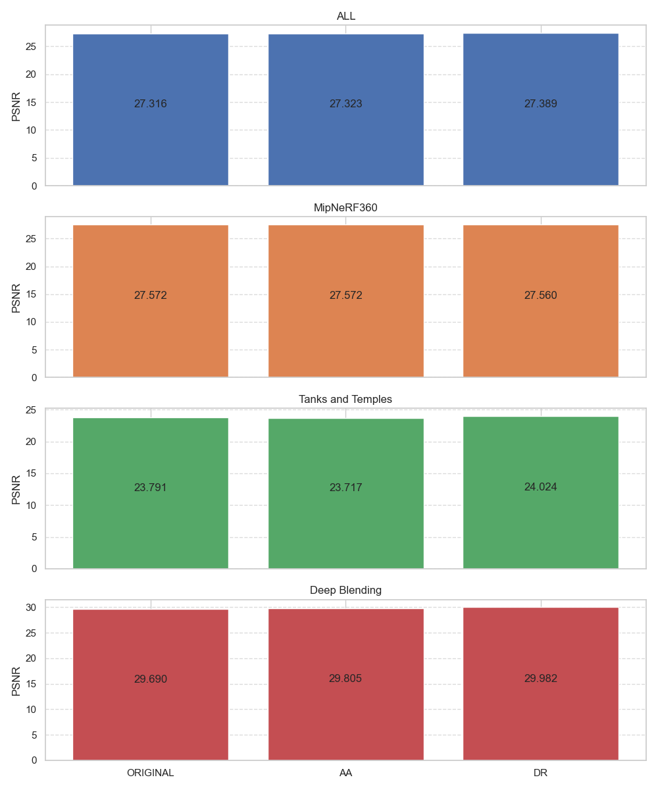
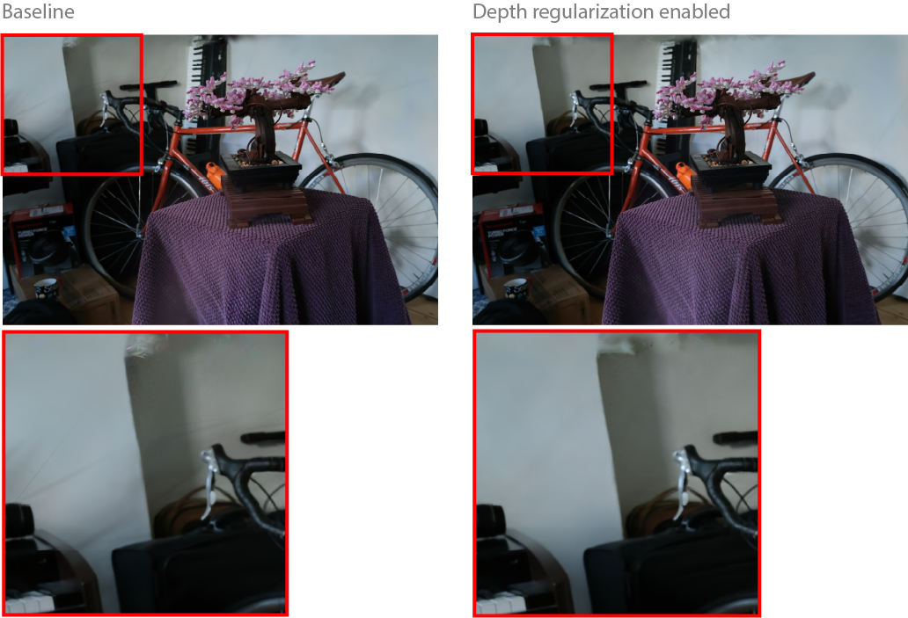
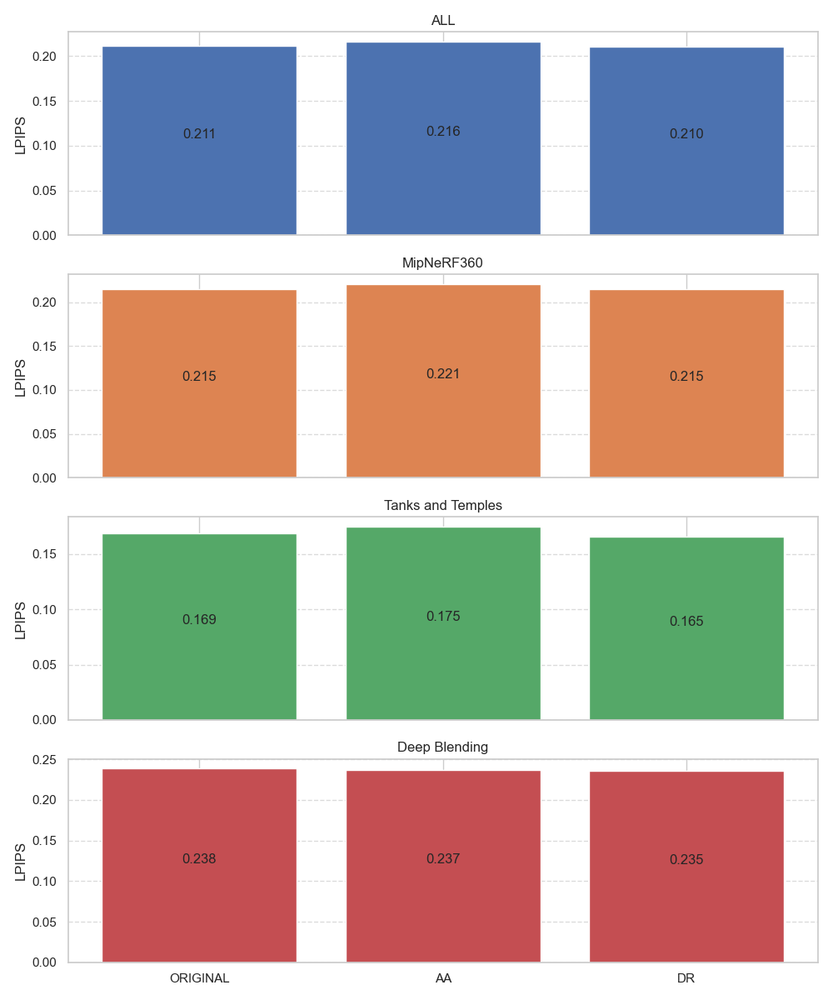
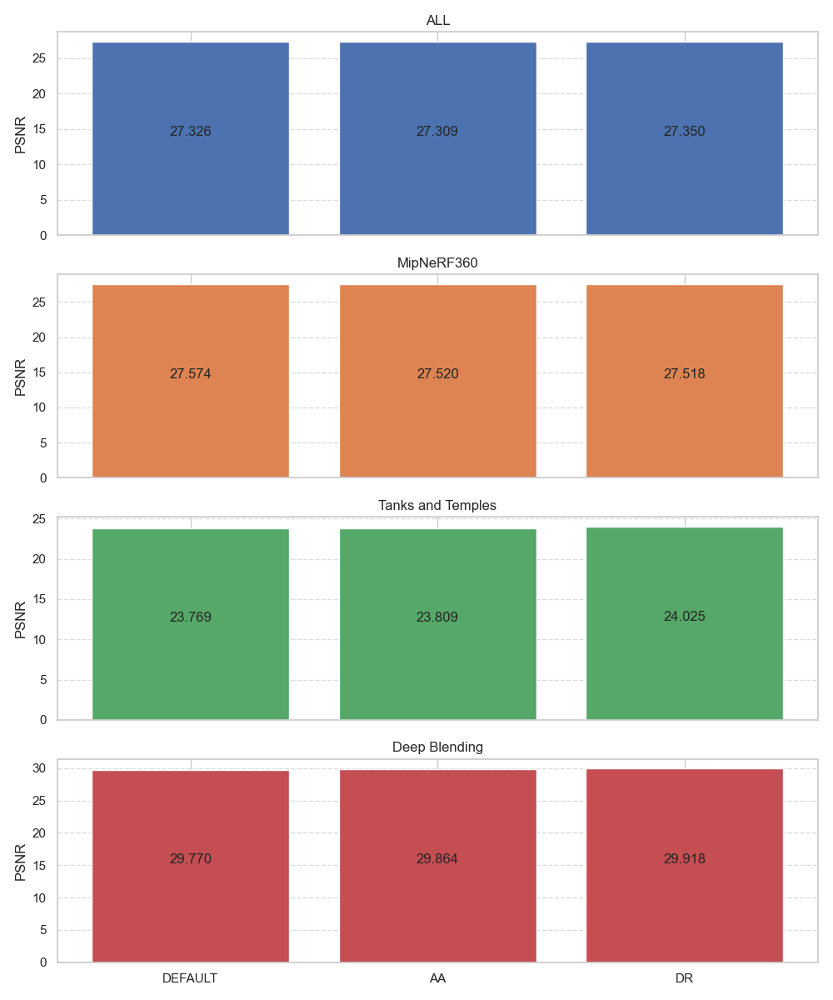
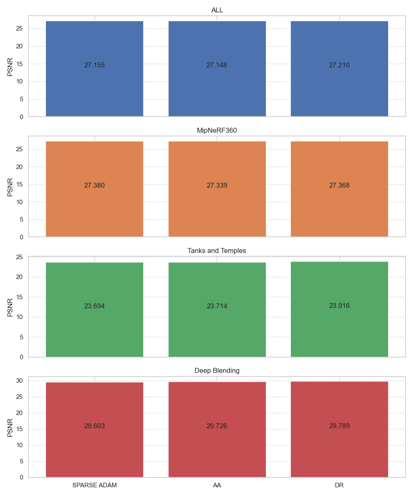
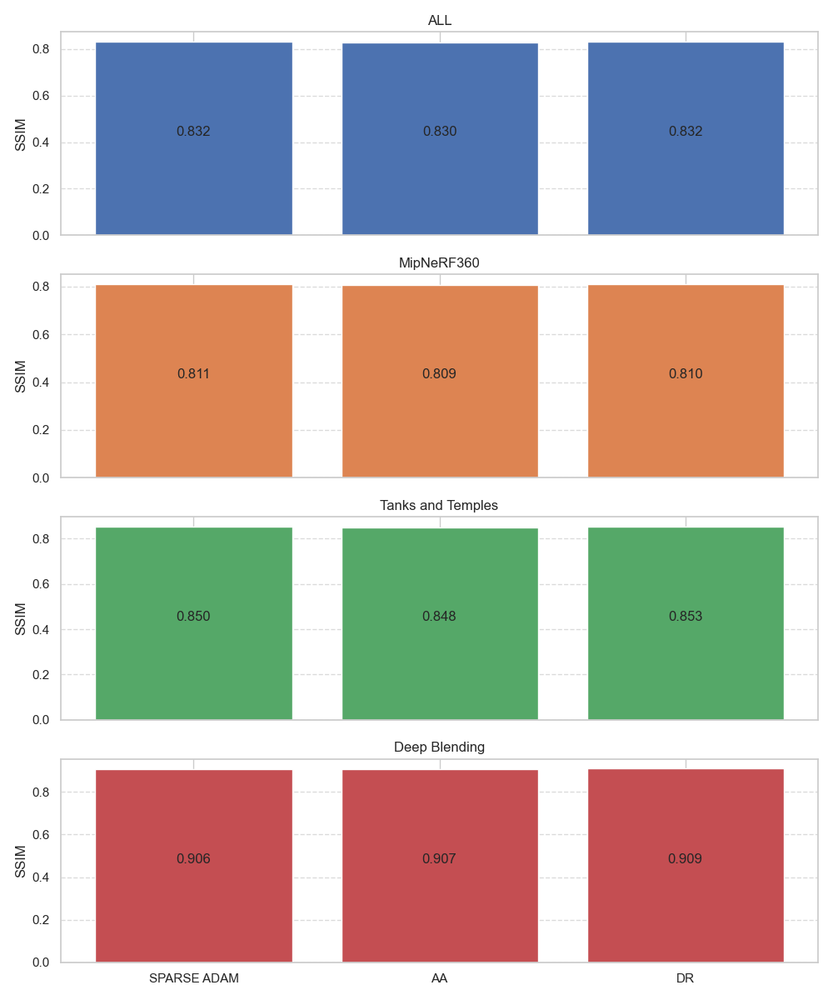
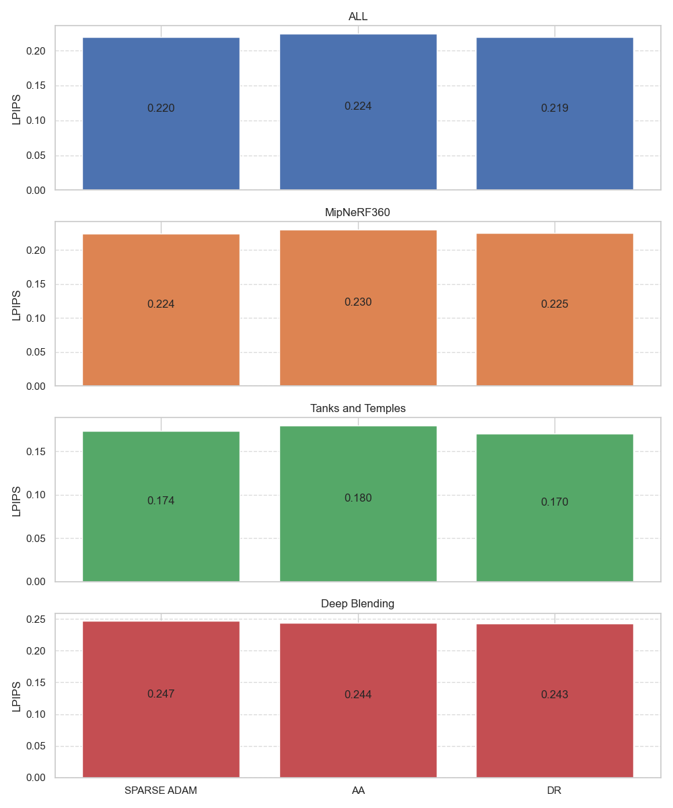
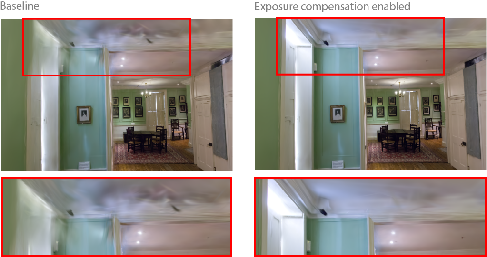
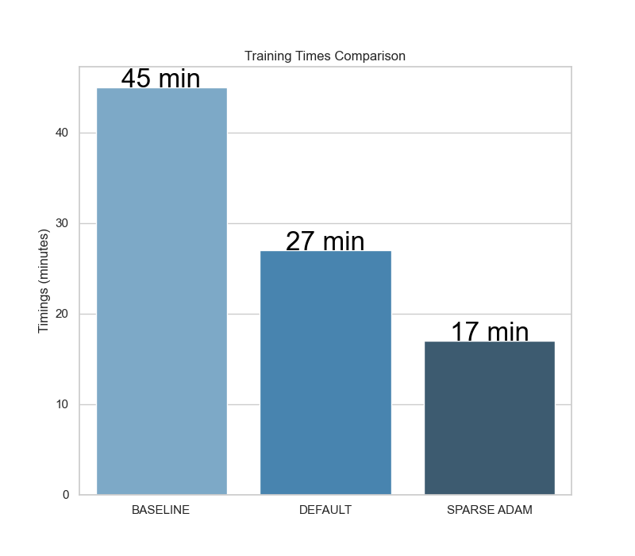

# Evaluations
We evaluated the impact of the features we added on MipNeRF360, Tanks&Temples and Deep Blending datasets. [Exposure Compensation](#exposure-compensation) is evaluated separately. Note that [Default rasterizer](#default-rasterizer) refers to the original [3dgs rasterizer](https://github.com/graphdeco-inria/diff-gaussian-rasterization/tree/9c5c2028f6fbee2be239bc4c9421ff894fe4fbe0) and [Accelerated rasterizer](#accelerated-rasterizer) refers to the [taming-3dgs rasterizer](https://github.com/graphdeco-inria/diff-gaussian-rasterization/tree/3dgs_accel).

## Default rasterizer

### PSNR

***DR**:depth regularization, **AA**:antialiasing*

 

### SSIM

***DR**:depth regularization, **AA**:antialiasing*

### LPIPS

*lower is better, **DR**:depth regularization, **AA**:antialiasing*

## Accelerated rasterizer

### Default optimizer

These numbers were obtained using the accelerated rasterizer and `--optimizer_type default` when training.

#### PSNR

***DR**:depth regularization, **AA**:antialiasing*

#### SSIM

***DR**:depth regularization, **AA**:antialiasing*

#### LPIPS

*lower is better, **DR**:depth regularization, **AA**:antialiasing*

### Sparse Adam optimizer

These numbers were obtained using the accelerated rasterizer and `--optimizer_type sparse_adam` when training.

#### PSNR

***DR**:depth regularization, **AA**:antialiasing*

#### SSIM

***DR**:depth regularization, **AA**:antialiasing*

#### LPIPS

*lower is better, **DR**:depth regularization, **AA**:antialiasing*

## Exposure compensation

We account for exposure variations between images by optimizing a 3x4 affine transform for each image. During training, this transform is applied to the colour of the rendered images.
The exposure compensation is designed to improve the inputs' coherence during training and is not applied during real-time navigation.
Enabling the `--train_test_exp` option includes the left half of the test images in the training set, using only their right halves for testing, following the same testing methodology as NeRF-W and Mega-NeRF. This allows us to optimize the exposure affine transform for test views. However, since this setting alters the train/test splits, the resulting metrics are not comparable to those from models trained without it. Here we provide results with `--train_test_exp`, with and without exposure compensation.

### PSNR

### SSIM

### LPIPS

*Lower is better.*

## Training times comparisons

We report the training times with all features enabled using the original 3dgs rasterizer *(baseline)* and the accelerated rasterizer with default optimizer then sparse adam.

